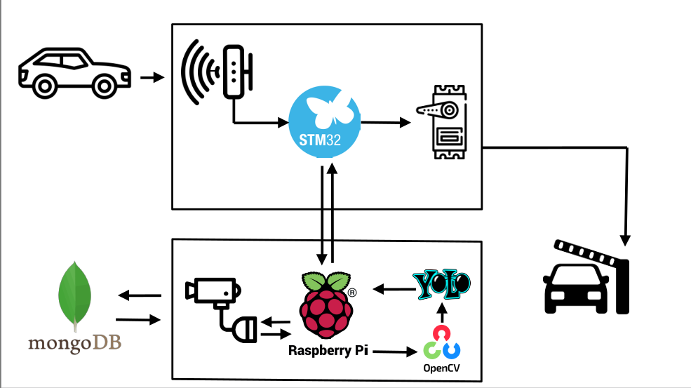

# Project ABC

* 이제까지 배운 AI, 임베디드 기술을 총동원하여 주차장 시스템을 구축해내는 프로젝트.

## High Level Design

* 

물체가 다가오면 초음파센서로 인지하여 라즈베리파이로 통신를 보낸다.
통신을 받은 라즈베리파이는 웹캠으로 물체를 촬영하고
차량이면 번호판을 OCR로 읽어낸다.
DB에 차량번호와 시간을 보내고
STM에게 열어도 좋다는 통신을 보낸다.
통신을 받은 STM은 서보모터를 작동하여 차단기를 올린다.

물체가 출구에 도착했을 때도 위와 같이 작동하되,
DB와의 통신으로 해당 차량이 얼마나 오랫동안 주차장에 있었는지를 계산하여 요금을 청구한다.
요금이 청구되면 차단기를 올려준다.

## Clone code

```shell
git clone https://github.com/HardCoding0417/Parking-lot-project
```

* 리눅스에서 cli git을 사용하고 있다면 아래의 방법으로 clone한다.

```shell
gh repo clone HardCoding0417/Parking-lot-project
```

## Prerequite

```shell
python -m venv .venv
source .venv/bin/activate
pip install -r requirements.txt
```
* requirements.txt로 설치가 잘 되지 않는다면
pymongo
sounddevice 
wavio
whisper
pyttsx3
ultralytics
cv2
pytesseract
pytesseract-ocr
을 개별적으로 설치해본다.

## Steps to build

* 라즈베리파이와 STM32 사이의 통신을 위한 UART설정이 필요하다.

```shell
cd ~/xxxx
source .venv/bin/activate

make
make install
```

## Steps to run

* (프로젝트 실행방법에 대해서 기술, 특별한 사용방법이 있다면 같이 기술)

```shell
cd ~/xxxx
source .venv/bin/activate

cd /path/to/repo/xxx/
python demo.py -i xxx -m yyy -d zzz
```

## Output

* (프로젝트 실행 화면 캡쳐)


## Appendix

* (참고 자료 및 알아두어야할 사항들 기술)
